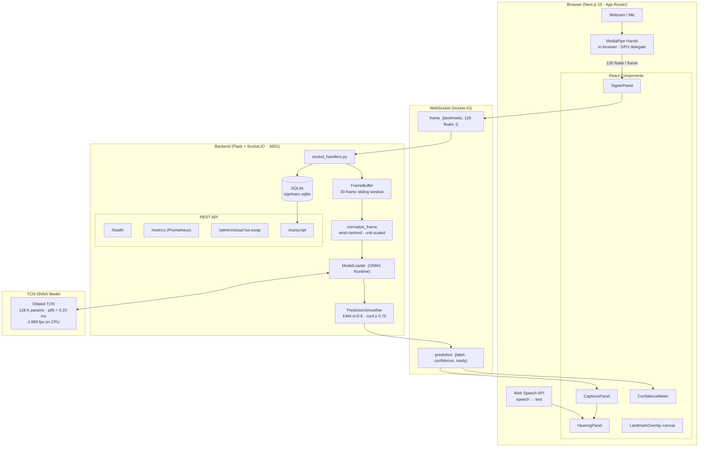
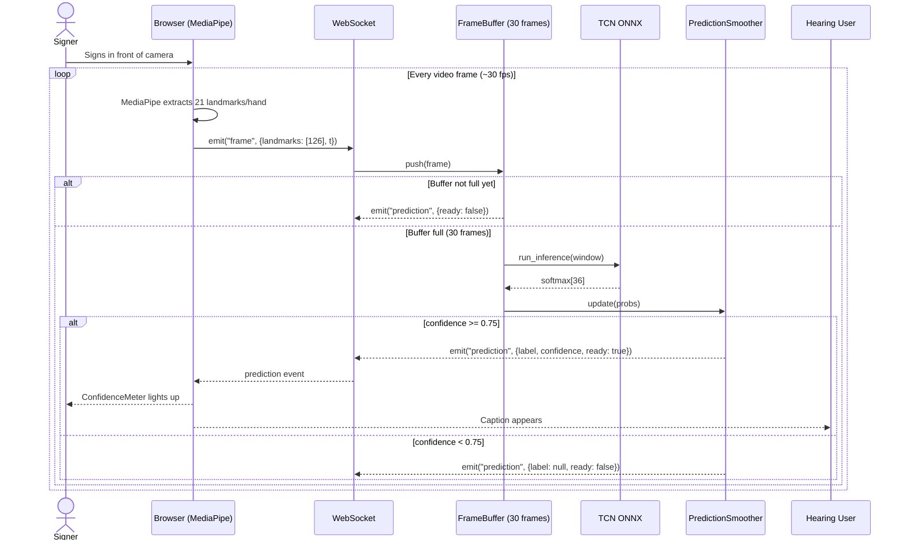
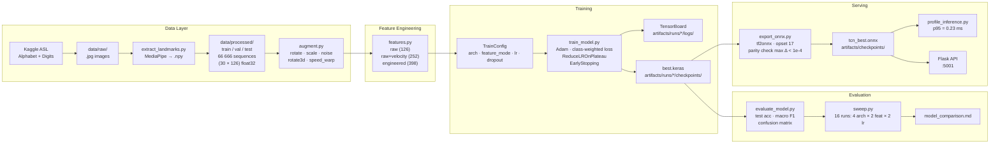
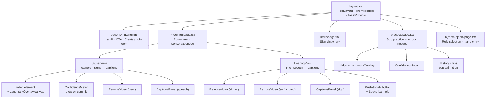
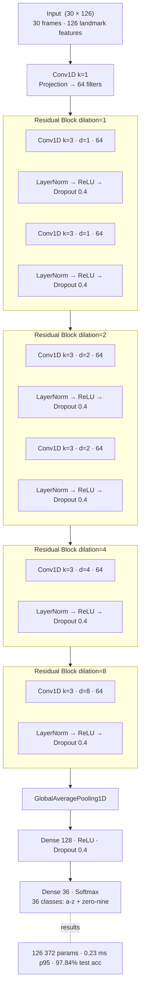

# SignLearn — Architecture Diagrams

> Diagrams are written in [Mermaid](https://mermaid.js.org/) — they render natively on GitHub, GitLab, Notion, and in VS Code with the "Markdown Preview Mermaid Support" extension.

---

## 1. System Architecture

---

## 2. Real-Time Data Flow (Sequence)

---

## 3. ML Training Pipeline

---

## 4. Component Hierarchy (Frontend)

---

## 5. Model Architecture — TCN

---

## Quick Reference

| Layer | Technology | Key numbers |
|---|---|---|
| Frontend | Next.js 15 · React · Socket.IO client | Hot reload, App Router |
| Hand tracking | MediaPipe Hands (in-browser) | 21 landmarks × 2 hands × 3 coords = 126 floats/frame |
| Transport | WebSocket (Socket.IO) | `frame` → server, `prediction` ← server |
| Frame buffer | Python (server) | 30 frames sliding window, stride = 1 |
| Model | TCN · ONNX Runtime | 126 K params · p95 = 0.23 ms · 4 889 fps |
| Accuracy | 36-class test set | 97.84% accuracy · 95.5% macro F1 |
| Backend | Flask + Flask-SocketIO | Port 5001 · threading mode |
| Storage | SQLite | Transcript · feedback · corrections |
